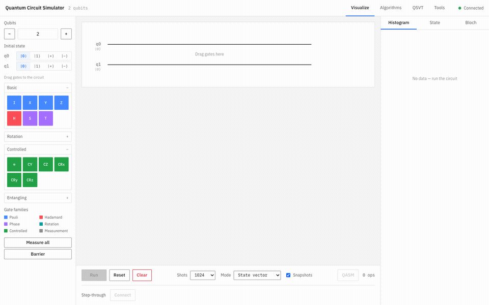
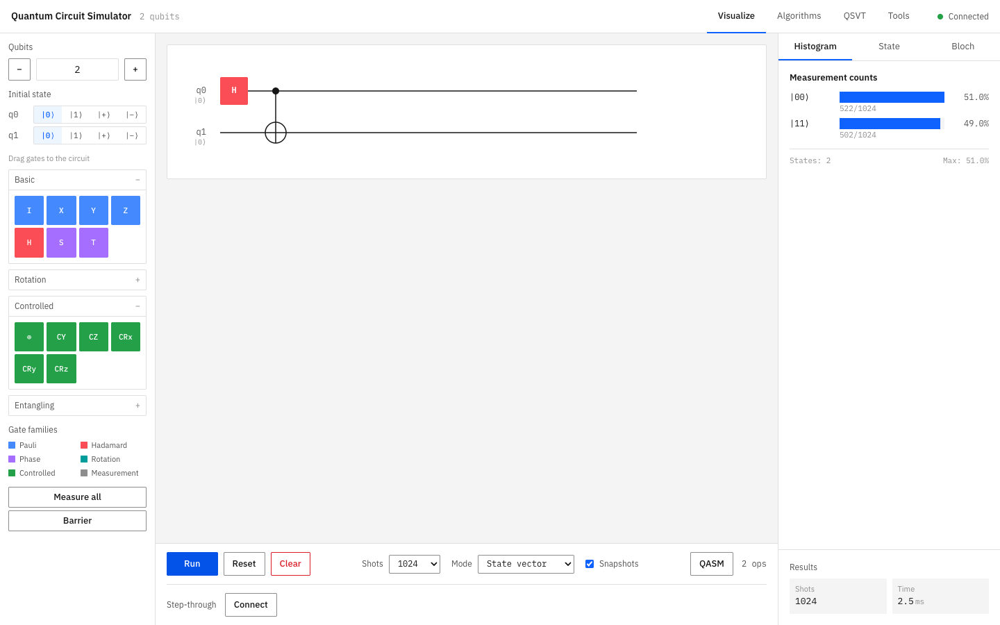
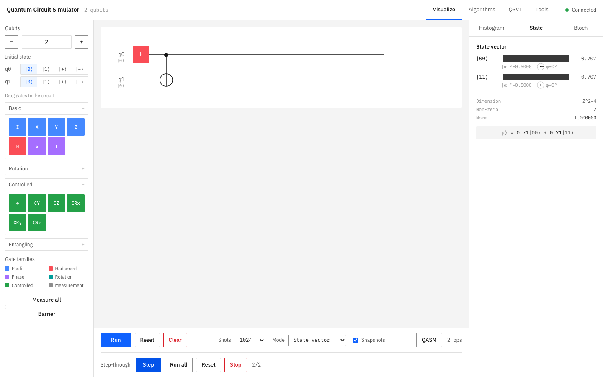
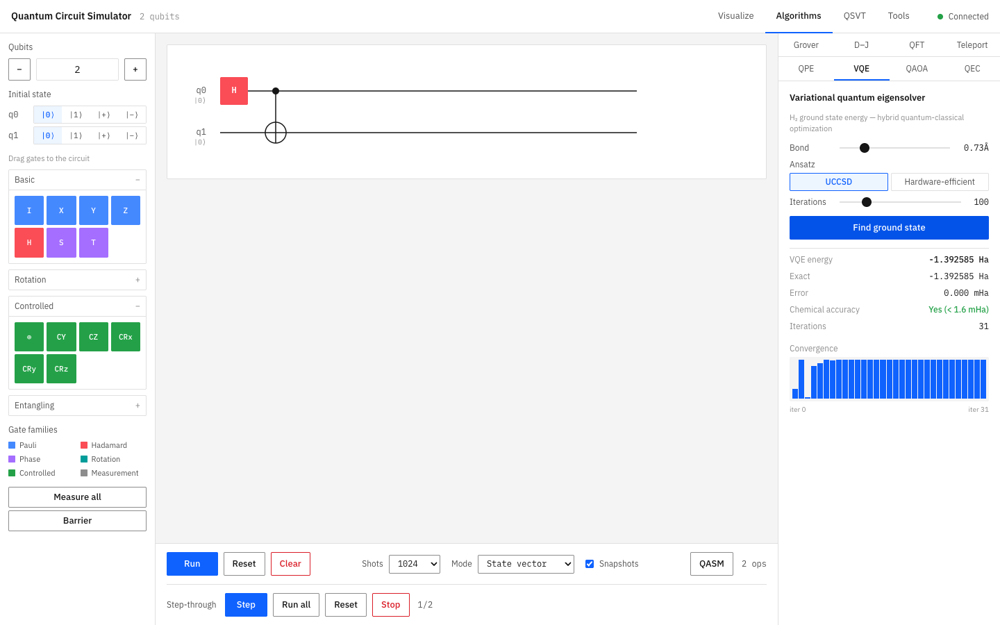

# Quantum Circuit Simulator

[](https://github.com/AbdelRahm4n/quantum-sim/actions/workflows/ci.yml)


A production-quality quantum circuit simulator with a Python/FastAPI backend and React/TypeScript/Three.js frontend.



| Bell state, 1024 shots in a few ms | Live WebSocket step-through | VQE finds the H2 ground state to 0.000 mHa |
|---|---|---|
|  |  |  | All quantum operations are implemented from scratch using NumPy - no Qiskit or external quantum libraries.

## Features

### Core Quantum Engine
- **State Vector Simulation**: hard cap of 20 qubits (~1M amplitudes), comfortable to ~14 qubits interactively
- **Tensor-Contraction Kernel**: gates are applied by contracting only their axes of the state tensor (O(2^n) per gate), not by building a dense 2^n x 2^n matrix
- **Density Matrix Mode**: For mixed states and noise simulation
- **All Standard Gates**: H, X, Y, Z, S, T, CNOT, CZ, Toffoli, rotations, and more
- **Parameterized Gates**: Rx, Ry, Rz, U3 with arbitrary angles
- **Projective Measurement**: With state collapse and sampling
- **Noise Channels**: Depolarizing, amplitude damping, phase damping via Kraus operators

### Frontend
- **Drag-and-Drop Circuit Builder**: Intuitive gate placement
- **Real-time Bloch Sphere**: 3D visualization using Three.js
- **State Vector Display**: Amplitude bars with probability and real phase
- **Measurement Histogram**: Result distribution
- **Export to OpenQASM**: Industry-standard format

### API
- **RESTful Endpoints**: Circuit CRUD, execution, analysis
- **WebSocket Support**: Real-time step-by-step execution
- **Redis Storage**: Session persistence for circuits

## Quick Start

### Using Docker (Recommended)

```bash
# Clone the repository
cd quantum-circuit-sim

# Start all services
docker-compose up -d

# Access the frontend at http://localhost:3000
# API available at http://localhost:8000
```

### Manual Setup

#### Backend

```bash
cd backend

# Create virtual environment
python -m venv venv
source venv/bin/activate  # On Windows: venv\Scripts\activate

# Install dependencies
pip install -r requirements.txt

# Run the server
uvicorn quantum_simulator.api.main:app --reload
```

#### Frontend

```bash
cd frontend

# Install dependencies
npm install

# Start development server
npm run dev
```

## Project Structure

```
quantum-circuit-sim/
├── backend/
│   ├── quantum_simulator/
│   │   ├── core/              # Quantum mechanics fundamentals
│   │   │   ├── gates.py       # All gate matrices
│   │   │   ├── state_vector.py
│   │   │   ├── density_matrix.py
│   │   │   ├── channels.py    # Noise channels
│   │   │   └── measurement.py
│   │   ├── circuit/           # Circuit abstraction
│   │   │   ├── circuit.py     # QuantumCircuit class
│   │   │   └── executor.py    # Execution engine
│   │   ├── analysis/          # Analysis tools
│   │   ├── storage/           # Redis persistence
│   │   └── api/               # FastAPI application
│   └── tests/
├── frontend/
│   └── src/
│       ├── components/
│       │   ├── CircuitBuilder/
│       │   └── Visualizations/
│       ├── stores/            # Zustand state management
│       ├── api/               # API client
│       └── types/
└── docker-compose.yml
```

## API Reference

### Circuits

```bash
# Create a circuit
POST /api/circuit
{
  "n_qubits": 2,
  "name": "bell_state",
  "operations": [
    {"type": "gate", "gate": {"gate_name": "H", "qubits": [0]}},
    {"type": "gate", "gate": {"gate_name": "CX", "qubits": [0, 1]}}
  ]
}

# Get circuit
GET /api/circuit/{circuit_id}

# Run circuit
POST /api/circuit/{circuit_id}/run
{
  "shots": 1024,
  "mode": "statevector",
  "record_snapshots": true
}

# Get state vector
GET /api/circuit/{circuit_id}/state

# Export to OpenQASM
GET /api/circuit/{circuit_id}/openqasm
```

### WebSocket

```javascript
// Connect for real-time execution
const ws = new WebSocket('ws://localhost:8000/ws/circuit/{id}/execute');

// Step through circuit
ws.send(JSON.stringify({ action: 'step' }));

// Run all
ws.send(JSON.stringify({ action: 'run_all' }));
```

## Examples

### Creating a Bell State

```python
from quantum_simulator.circuit import QuantumCircuit
from quantum_simulator.circuit.executor import run_circuit

# Create circuit
qc = QuantumCircuit(2)
qc.h(0).cx(0, 1).measure_all()

# Execute
result = run_circuit(qc, shots=1000)
print(result.counts)  # {'00': ~500, '11': ~500}
```

### GHZ State

```python
qc = QuantumCircuit(3)
qc.h(0).cx(0, 1).cx(1, 2)
sv = get_statevector(qc)
print(sv)  # (0.707)|000⟩ + (0.707)|111⟩
```

### Noisy Simulation

```python
from quantum_simulator.core.channels import NoiseModel

noise = NoiseModel()
noise.add_depolarizing(0.01)  # 1% depolarizing error

result = run_circuit(qc, shots=1000, noise_model=noise)
```

## Gate Reference

### Single-Qubit Gates
| Gate | Matrix | Description |
|------|--------|-------------|
| I | Identity | No operation |
| X | Pauli-X | Bit flip |
| Y | Pauli-Y | Bit + phase flip |
| Z | Pauli-Z | Phase flip |
| H | Hadamard | Creates superposition |
| S | √Z | π/2 phase |
| T | √S | π/4 phase |

### Rotation Gates
| Gate | Parameters | Description |
|------|------------|-------------|
| Rx(θ) | θ | X-axis rotation |
| Ry(θ) | θ | Y-axis rotation |
| Rz(θ) | θ | Z-axis rotation |
| U3(θ,φ,λ) | θ,φ,λ | Universal gate |

### Two-Qubit Gates
| Gate | Description |
|------|-------------|
| CX/CNOT | Controlled-X |
| CY | Controlled-Y |
| CZ | Controlled-Z |
| SWAP | Swaps qubits |
| iSWAP | iSWAP gate |

### Three-Qubit Gates
| Gate | Description |
|------|-------------|
| CCX/Toffoli | Controlled-controlled-X |
| CSWAP/Fredkin | Controlled SWAP |

## Running Tests

```bash
cd backend
pytest tests/ -v
```

### Cross-validation against Qiskit

The engine is oracle-verified: `tests/test_qiskit_validation.py` runs every gate in the library (on every qubit placement) plus 30 randomized deep circuits on both this simulator and Qiskit's `Statevector`, asserting the final states agree to fidelity 1 within 1e-9. The suite runs in CI and skips gracefully if qiskit is not installed locally.

```bash
pip install qiskit
pytest tests/test_qiskit_validation.py -v
```

## Performance

- State vector: hard cap of 20 qubits (1M amplitudes, ~16 MB). Practical interactive range is ~14 qubits; the per-qubit Bloch and entanglement views trace over the full state and become the limiter beyond that.
- Density matrix: up to 14 qubits (for mixed states).
- Gate application: O(2^n) per gate. The state is reshaped into an n-index tensor and only the gate's axes are contracted (via `np.tensordot`), avoiding the O(4^n) cost of materializing a full 2^n x 2^n gate matrix.
- Sampling: terminal measurements are drawn once from the final distribution instead of re-simulating the circuit for every shot.

## Technology Stack

### Backend
- Python 3.10+
- NumPy for linear algebra
- SciPy for optimization (VQE)
- FastAPI for REST API
- Redis for session storage

### Frontend
- React 18 with TypeScript
- Three.js + React Three Fiber for 3D
- Tailwind CSS for styling
- Zustand for state management
- TanStack Query for API calls

## License

MIT License

## Contributing

Contributions are welcome! Please read our contributing guidelines and submit pull requests.
